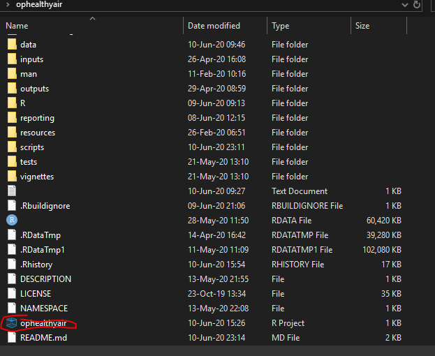

# Operation Healthy Air

Operation Healthy Air deploys Particulate Matter Air Quality Sensors in communities across the globe to build community data literacy and environmental resiliency by engaging and empowering citizen scientists. This repository is the underlying codebase of the programs data pipeline and visualizations.

### Prerequisites
To use this scripts in this package, run the following code once after installation.

```
dir.create("data/spatial")
MazamaSpatialUtils::setSpatialDataDir("data/spatial")
MazamaSpatialUtils::installSpatialData

```


## Usage

This project is centered around several R scripts, all located in the scripts/ directory. 
The main scripts users will interact with are:

* ingest_all.R
* make-site-dataviz-pkg.R
* make-proxy-calibration.R
* weekly-sensor-health-report.R
* make-proxy-calibration-all.R

These scripts should primarily be run from the Rstudio Terminal by opening the project (ophealthyair/ophealthyair.Rproj)



And running the script from the Rstudio terminal.


For more info on the Rstudio terminal see [here](https://github.com/adam-p/markdown-here/wiki/Markdown-Cheatsheet).

An R script is run from the terminal using the Rscript command, followed by the relative path to the file (`scripts/name_of_script.R `. 

For example: 

```
Rscript scripts/ingest_all.R
```

If a script is specified as having a Command Line Interface (CLI), options are provided by appending the option after the script name, using either the shorthand or longhand argument name.

```
# These commands do the same thing.
Rscript scripts/ingest_all.R -p Example/Path/Sensor_Catalog.xlsx
Rscript scripts/ingest_all.R --catalog_path Example/Path/Sensor_Catalog.xlsx
```
Multiple arguments are passed to a script by appending with a space.

```
# These commands do the same thing.
Rscript scripts/ingest_all.R -p Example/Path/Sensor_Catalog.xlsx -l 35
Rscript scripts/ingest_all.R --catalog_path Example/Path/Sensor_Catalog.xlsx --lookback_days 35
```

Any script with a CLI can be passed a -h or --help argument to view the script options without running the script.

```
Rscript scripts/ingest_all.R --help
```
If it's your first time running a script, it is recommended to read the help option before running.

### ingest_all.R (CLI)

Import and save Sensor Catalog from a given excel workbook and, if possible, loads data for all sensors with a Deploy Site that is not "Undeployed".

The Sensor Data ingested by this script is saved as pat_list.RDS in the data folder, and is loaded by all the following scripts.
So, before running any of the below scripts, this script should be run. I typically run it at the beginning of the day (it can take upwards of an hour to complete) if I'm going to be running any other scripts. 

### make-site-dataviz-pkg.R (CLI)

Create a single data visualization package for a given site (must be )

### weekly-sensor-health-report.R (CLI)


## To Do:
1. Make CLI for weekly-sensor-health-report.R
2. Schedule regular tasks to run in their own environment.
3. Work on TODO's (mostly error control systems).

## License
GPL-3

## Authors

* Ian Ozeroff

## Acknowledgements
* Mazama Science
* OpenAir
* OpenAQ
